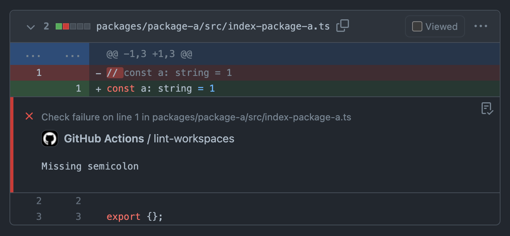
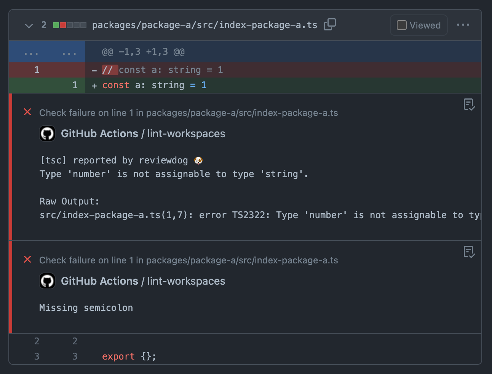

# pipe-if-ci

Node.js implementation of a command to run pipeline only when in a CI environment.

## Installation

```console
$ npm install -D pipe-if-ci
```

## Usage

```console
$ pipe-if-ci --help
Run pipeline only when in a CI environment.

pipe-if-ci <command> [--pipe|-p <command-for-ci>]

Options:
  -p, --pipe     run your program                            [string] [required]
  -h, --help     Show help                                             [boolean]

Examples:
      pipe-if-ci 'tsc --noEmit' --pipe 'reviewdog -f=tsc -reporter=github-check -fail-on-error'
```

## Use Cases: GitHub Annotations

GitHub Actions has a mechanism called [Problem Matchers](https://github.com/actions/toolkit/blob/main/docs/problem-matchers.md). If you output error messages that matches a Problem Matchers, the messages are displayed inline on the "Files changed" tab of the Pull Request. This inline error messages is called a [GitHub Annotations](https://github.com/actions/toolkit/blob/main/docs/problem-matchers.md).



However, GitHub Annotation by Problem Matchers does not work for error messages containing paths relative to non-repository root directory. For example, in mono-repo, there is a problem with tsc error messages in individual packages not being displayed inline by GitHub Annotation.

- [Use absolute file paths in error messages · Issue #36221 · microsoft/TypeScript](https://github.com/microsoft/TypeScript/issues/36221#issuecomment-1114711370)

To solve this problem, you can use [Reviewdog](https://github.com/reviewdog/reviewdog). Reviewdog can interpret relative paths based on the current working directory and display GitHub Annotation using the [`@actions/core` API](https://github.com/actions/toolkit/tree/main/packages/core#annotations).

- [--reporter=github-pr-review does not work with sub directory · Issue #225 · reviewdog/reviewdog](https://github.com/reviewdog/reviewdog/issues/225)

To use this workaround, simply rewrite npm-script as follows:

```diff
  "scripts": {
-   "lint": "tsc --noEmit",
+   "lint": "tsc --noEmit | reviewdog -f=tsc -reporter=github-check -fail-on-error",
  }
```

However, this approach has the following disadvantages

- Requires installation of reviewdog in the local environment as well
- In the local environment, color is lost from the colorful logs of tsc.

This is where `pipe-if-ci` comes in: with `pipe-if-ci`, you can easily write an npm-script that pipes the output of tsc to reviewdog in the CI environment and displays the output of tsc directly in the terminal in the local environment.

```diff
  "scripts": {
-   "lint": "tsc --noEmit",
+   "lint": "pipe-if-ci 'tsc --noEmit' --pipe 'reviewdog -f=tsc -reporter=github-check -fail-on-error'",
  }
```

Try it out! :)

- [Example of pull request](https://github.com/mizdra/problem-matcher-test/pull/2/files)



## Programmable API

See [src/index.js](https://github.com/mizdra/node-pipe-if-ci/blob/main/src/index.js) for full API implementation and details.

```js
import { pipeIfCI } from 'pipe-if-ci';

await pipeIfCI('tsc --noEmit', { pipe: 'reviewdog -f=tsc -reporter=github-check -fail-on-error' });
```

## License

MIT
